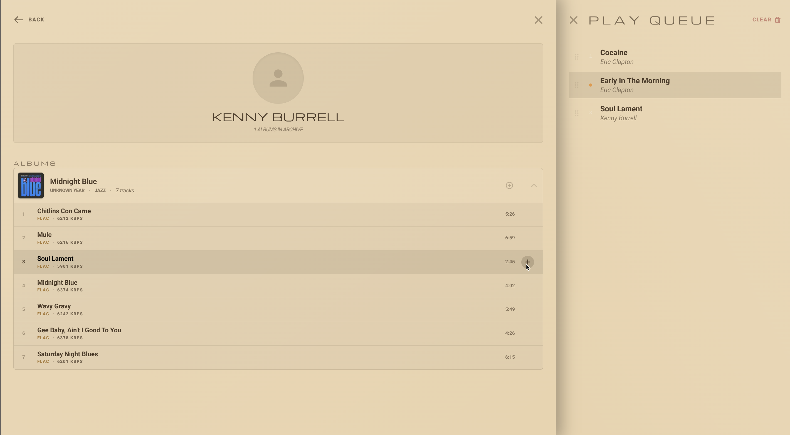

# WebSonic — Digital Jukebox Interface

A high-fidelity, analog-inspired web remote for Subsonic-compatible music servers (optimized for Gonic).

### 🌐 Demo
[**websonic.pages.dev**](https://websonic.pages.dev/)
> [!IMPORTANT]
> A running **Gonic** or other **Subsonic-compatible** server is required for the demo to function.


*Analog interface with Gold accents*


*Detailed library and queue view*

## 🛠 Features
> [!WARNING]
> ⚠️ **Under Development**: This project is in an early development stage! 🚀

## 🛠 Road Map
- [x] Base Layout (Analog Equipment UI)
- [x] Auth (Subsonic Integration)
- [ ] Music Library
    - [x] Artists, Genres, Playlists listing pages
    - [ ] Filter by Artists, Albums, Genres, Search
    - [ ] Play songs, albums, playlists
- [x] Queue Management (Add, Remove, Reorder, Play)
- [x] Now Playing (Album Art, Song Info, Progress Bar)
- [x] Playback Controls (Play, Pause, Next, Previous)
- [ ] Playlist Management (Create, Edit, Delete, Play)
- [ ] High quality theme redesign
- [ ] Refactor code
- [ ] Multi-server Support (Add, Remove, Switch)

## 📦 Getting Started

### Installation
1. Clone the repository
2. Install dependencies: `npm install`
3. Run development server: `npm run dev`

### Docker Support

**Quick Start with Docker Hub (Pre-built image):**
```bash
docker run -d -p 8080:80 --name websonic imone/websonic:dev
```

**Build and run from source:**
1. Build the image (from the project root):
```bash
docker build -t websonic -f docker/Dockerfile .
```

**2. Run the container**:
```bash
docker run -d -p 8080:80 --name websonic-app websonic
```
Your Jukebox will be available at `http://localhost:8080` (you can change 8080 to any port you like).